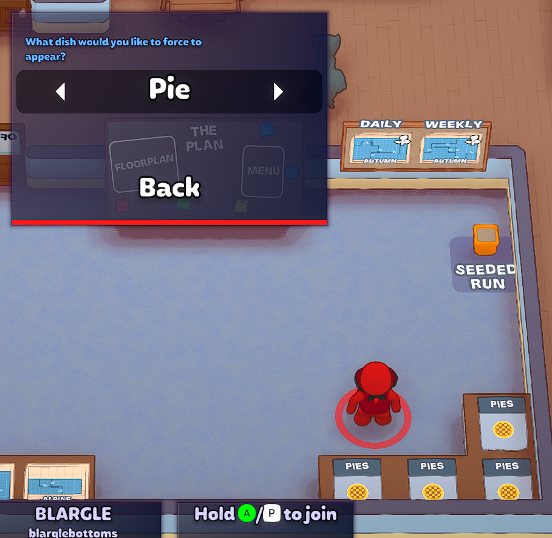

# plateup starting meal selector

Adds a menu option to select the starting meal, in case the game didn't give you the option you wanted when you launched it, so you don't need to relaunch the game.

While paging through the options, all recipe cards on the lobby screen will update to the recipe you have selected.

Note:  This will only show the recipes that you have unlocked.

## Requirements

* BepinEx >= 5.4.21

## Installation

* Download StartingMealSelector.dll and add to your `PlateUp/BenInEx/plugins` folder.
